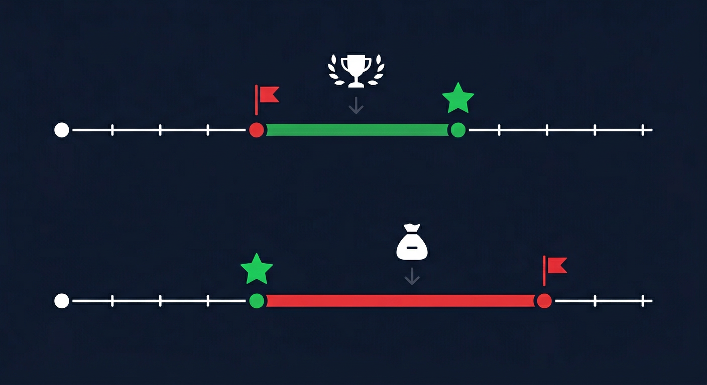

---
## Author
author:
  name: Андрюшин Никита Сергеевич
## Title
title: Доклад
subtitle: Аукцион второй цены
license: CC BY
date: today
date-format: "YYYY-MM-DD" # Example: 2025-09-06
---

# Информация

## Докладчик

:::::::::::::: {.columns align=center height=70%}
::: {.column width="70%" height=70%}

  * Андрюшин Никита Сергеевич
  * Студент
  * Российский университет дружбы народов им. П. Лумумбы

:::
::: {.column width="30%" height=70%}

:::
::::::::::::::

# Основная часть

## Актуальность темы

:::: {.columns}

::: {.column width="50%"}
Аукционы — универсальный механизм распределения ресурсов в современной экономике.   

Google проводит **миллионы рекламных торгов каждую секунду**   
Правительства распределяют через аукционы **радиочастоты и государственный долг**   
Christie's и eBay ежедневно продают **тысячи лотов**   

> *Как устроить торги так, чтобы лот достался тому, кто ценит его больше всего, и при этом никому не было выгодно хитрить?*   

Ответ на него даёт **аукцион второй цены**.   
:::

::: {.column width="50%"}

:::

::::

## Объект, предмет, новизна, значимость

:::: {.columns}

::: {.column width="100%"}
**Объект исследования** - Механизм аукциона второй цены (аукциона Викри)   

**Предмет исследования** - Стратегические свойства, уязвимости и области применения механизма   

**Научная новизна** - Систематическое сопоставление теоретических достоинств механизма с его практическими ограничениями   

**Практическая значимость** - Понимание механизма необходимо для проектирования торговых платформ, систем интернет-рекламы и государственных закупок   
:::

::: {.column width="0%"}

:::

::::

## Цель, гипотеза, задачи

:::: {.columns}

::: {.column width="100%"}
**Цель** - Исследовать механизм аукциона второй цены: доказать оптимальность честной стратегии и выявить ограничения в реальных условиях

**Гипотеза** - В аукционе второй цены участнику выгоднее всего ставить ровно столько, сколько он готов заплатить — однако это свойство выполняется лишь при определённых условиях

**Задачи**   

Описать механизм и ввести понятийный аппарат   
Доказать доминирование честной стратегии   
Сравнить с аукционом первой цены   
Выявить уязвимости аукциона Викри   
Проанализировать практические применения   
:::

::: {.column width="0%"}

:::

::::

## Механизм: как устроен аукцион второй цены

:::: {.columns}

::: {.column width="50%"}
**Правила**

Каждый из $n$ участников подаёт **закрытую ставку** $b_i$ одновременно с остальными   
Побеждает участник с **наибольшей ставкой**: $i^* = \arg\max_i b_i$   
Победитель платит **вторую по величине ставку**: $P = \max_{j \neq i^*} b_j$   

Выигрыш A: $1000 - 750 = 250$ руб.
:::

::: {.column width="50%"}

:::

::::

## Доказательство: честная ставка оптимальна

:::: {.columns}

::: {.column width="55%"}
Пусть $M = \max_{j \neq i} b_j$ — наибольшая ставка соперников.

**Случай 1: $v_i > M$**

$0 \longrightarrow M \longrightarrow v_i$

Честная ставка → победа, платёж $M$, выигрыш $v_i - M > 0$.
Занижение ниже $M$ → проигрыш. **Хуже.**

**Случай 2: $v_i < M$**

$0 \longrightarrow v_i \longrightarrow M$

Честная ставка → проигрыш, выигрыш $0$.
Завышение выше $M$ → выигрыш отрицательный. **Хуже.**

**Вывод:** $b_i = v_i$ — **слабо доминирующая стратегия**.

:::

::: {.column width="45%"}

> Ваша ставка определяет *выиграете ли вы*. Платёж определяется *только соперниками*.	

:::

::::

## Сравнение с аукционом первой цены

:::: {.columns}

::: {.column width="100%"}
В аукционе первой цены победитель платит **свою** ставку → ставить $v_i$ бессмысленно. Участники **занижают ставки**.

При $n$ участниках с оценками на $[0, 1]$:

$$b_i^* = v_i \cdot \frac{n-1}{n}$$

| Характеристика | 1-я цена | 2-я цена |
|:---|:---:|:---:|
| Платёж победителя | Своя ставка | Вторая ставка |
| Оптимальная стратегия | Занизить | $b_i = v_i$ |
| Нужно знать соперников? | **Да** | **Нет** |
| Доход продавца | Одинаков | Одинаков |
| Уязвимость к манипуляциям | Умеренная | **Высокая** |

:::

::: {.column width="0%"}

:::

::::

## Уязвимости аукциона Викри

:::: {.columns}

::: {.column width="75%"}
**Манипуляции продавца** - Победитель платит цену, которую не видит. Организатор может завысить объявленную вторую ставку — проверить невозможно.   

**Фантомные ставки (shill bidding)** - Подставной участник делает ставку чуть ниже победной, искусственно завышая платёж. В закрытом аукционе не обнаруживается.   

**Сговор покупателей** - «Сообщник» ставит 0 — победитель платит почти ничего. Сговор устойчив: нарушать его невыгодно никому из коалиции.   

**Взаимозависимые оценки** - Если ценность лота одинакова для всех (нефтяное месторождение), честная ставка перестаёт быть оптимальной. Возникает «проклятие победителя».   
:::

::: {.column width="25%"}

:::

::::

## Практические применения

:::: {.columns}

::: {.column width="65%"}
**Интернет-реклама: Google Ads, Яндекс.Директ** - GSP-аукцион: победитель занимает лучшую позицию, платит ставку конкурента. Доверие — через масштаб и репутацию платформы.   

**eBay: система proxy bidding** - Вы указываете максимум — система торгуется за вас. Победитель платит чуть больше второй ставки. 	

**Государственные облигации** - Аукционы единой цены: все победители платят одну цену отсечения. США применяют этот формат с 1998 года.   

> Ни одна реализация не использует аукцион Викри в чистом виде - каждая содержит институциональный механизм, компенсирующий его уязвимости.
:::

::: {.column width="35%"}

:::

::::

## Выводы

:::: {.columns}

::: {.column width="100%"}
**Механизм:** победитель платит вторую цену — простое правило с сильным следствием

**Главный результат:** $b_i = v_i$ — доминирующая стратегия; честность рациональна, а не только добродетельна   

**Эквивалентность доходов:** при стандартных допущениях продавец получает одинаковый доход в обоих форматах   

**Уязвимости:** закрытость платежа открывает путь к манипуляциям продавца и сговору покупателей   

**Наследие Викри:** *как сделать честное поведение рационально выгодным?* — центральный вопрос современного механизм-дизайна   
:::

::: {.column width="0%"}

:::

::::
