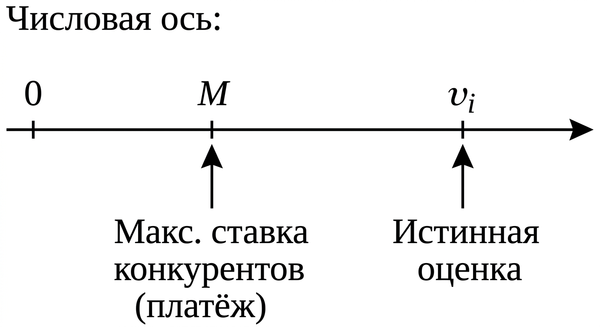
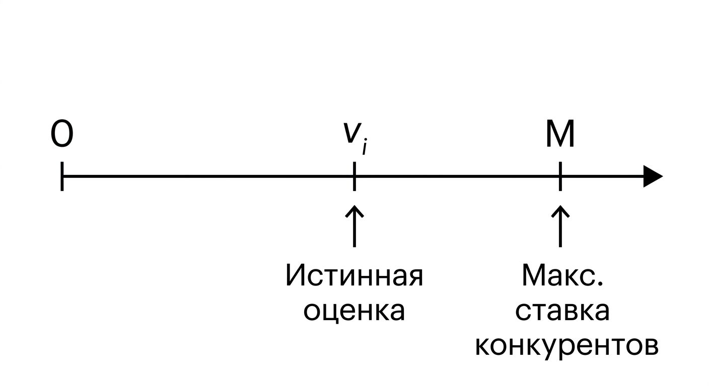

---
## Author
author:
  name: Андрюшин Никита Сергеевич

## Title
title: "Реферат"
subtitle: "Аукцион второй цены"
license: "CC BY"
---

## Введение

Аукционы - один из древнейших способов торговли. Ещё в Древнем Риме с молотка продавали военные трофеи, а в Вавилоне, по свидетельству Геродота, таким образом выдавали замуж невест. Сегодня аукционы повсюду: Christie's продаёт картины Пикассо, правительства распределяют лицензии на радиочастоты, а Google каждую секунду проводит миллионы торгов за рекламные места в результатах поиска. За этим разнообразием стоит единый вопрос: как устроить торги так, чтобы нужная вещь досталась тому, кто её больше всего ценит, и чтобы при этом никто не мог выиграть, хитря или блефуя?

Именно на этот вопрос претендует ответить аукцион второй цены, известный также как аукцион Викри - в честь канадско-американского экономиста Уильяма Викри, формально исследовавшего его свойства в 1961 году [@vickrey1961]. Идея механизма обескураживающе проста: побеждает тот, кто предложил больше всех, однако платит он не свою ставку, а ставку ближайшего конкурента. Это незначительное, на первый взгляд, изменение правил порождает замечательное следствие: каждому участнику выгоднее всего называть именно ту сумму, которую он на самом деле готов заплатить - ни больше, ни меньше. Честность оказывается не моральным требованием, а рациональной стратегией.

Вместе с тем у этого механизма есть и обратная сторона. Стратегическая простота для участников-покупателей достигается ценой появления новых уязвимостей - прежде всего со стороны продавца и организатора торгов. В настоящем реферате мы разберём, как устроен аукцион Викри, докажем, почему честная ставка является оптимальной, сравним его с аукционом первой цены, а затем подробно остановимся на его слабых местах и ограничениях.

## История и основные понятия

Уильям Викри (1914–1996) большую часть жизни проработал профессором Колумбийского университета и занимался самым широким кругом вопросов - от городского транспорта до налоговой политики. Его статья 1961 года «Counterspeculation, Auctions, and Competitive Sealed Tenders» [@vickrey1961] стала основополагающей для всей теории аукционов: в ней он систематически сравнил различные форматы торгов, сформулировал теорему об эквивалентности доходов и описал аукцион второй цены как механизм с исключительно удобными стратегическими свойствами. Признание пришло поздно - в 1996 году Викри получил Нобелевскую премию по экономике за «фундаментальный вклад в теорию стимулов при асимметрии информации» [@nobel1996], однако скончался через три дня после объявления о награде, так и не успев прочитать нобелевскую лекцию.

Чтобы говорить об аукционах строго, нужно договориться о нескольких понятиях [@krishna2009; @osborne1994]. Оценка участника $v_i$ - это максимальная сумма, которую он готов заплатить за лот; по существу, это его субъективная ценность товара. Оценка является частной информацией: каждый знает свою, но не знает чужих. Ставка $b_i$ - это то, что участник объявляет на аукционе; ставка не обязана совпадать с оценкой. Разница между оценкой и уплаченной ценой называется выигрышем участника: если участник с оценкой $v_i$ побеждает и платит $P$, его выигрыш равен $v_i - P$.

В теории игр стратегия называется доминирующей, если она является наилучшим ответом на любые действия противников - вне зависимости от того, что те делают [@osborne1994]. Это более сильное понятие, чем равновесие Нэша [@nash1951]: равновесие предполагает взаимную оптимальность при фиксированных ожиданиях о поведении других, тогда как доминирующая стратегия оптимальна безусловно и не требует никаких предположений о соперниках. Именно такой стратегией - в чём мы скоро убедимся - является честная ставка в аукционе Викри.

Стандартная теоретическая модель аукционов предполагает независимые частные оценки (IPV - Independent Private Values): оценки участников независимы друг от друга и каждому известна только его собственная [@myerson1981]. Это допущение разумно для многих практических ситуаций - например, когда люди покупают товар для личного использования и их готовность платить не зависит от того, насколько другие ценят этот же товар. Впрочем, как мы увидим в разделе о недостатках, именно выход за рамки этой идеализированной модели обнажает уязвимости аукциона Викри.

## Механизм работы аукциона второй цены

Правила аукциона второй цены можно изложить в трёх предложениях. Каждый из $n$ участников одновременно и независимо подаёт закрытую ставку $b_i$. Побеждает тот, чья ставка оказалась наибольшей. Победитель платит вторую по величине ставку:

$$P = \max_{j \neq i^*} b_j, \quad \text{где } i^* = \arg\max_i\, b_i.$$

Поскольку все ставки подаются одновременно и в закрытом виде, никто не знает предложений соперников в момент принятия решения. Именно эта закрытость формально отличает аукцион Викри от английского аукциона с открытым повышением цены - хотя при независимых частных оценках оба формата стратегически эквивалентны [@milgrom1982]: в английском аукционе участники выходят из торгов один за другим по мере роста цены, и последний оставшийся побеждает, заплатив фактически вторую по величине оценку.

Рассмотрим числовой пример. Предположим, четыре участника борются за старинную монету, и их оценки таковы, как указано в [табл. @tbl-comp].

| Участник | Истинная оценка $v_i$, руб. | Ставка $b_i$, руб. | Результат                    |
|:--------:|:---------------------------:|:-------------------:|:-----------------------------|
| A        | 1 000                       | 1 000               | Победитель, платит 750 руб.  |
| B        | 750                         | 750                 | Проигрывает                  |
| C        | 600                         | 600                 | Проигрывает                  |
| D        | 400                         | 400                 | Проигрывает                  |

: Пример аукциона второй цены с четырьмя участниками {#tbl-comp}

Как видно из таблицы, побеждает участник A с наибольшей ставкой в 1 000 руб., однако платит он лишь 750 руб. - ставку ближайшего соперника B. Его выигрыш составляет $1000 - 750 = 250$ руб. Остальные участники не получают ничего и ничего не платят.

## Доминирующая стратегия: правдивое раскрытие оценки

Перейдём к центральному результату. Утверждение, которое мы собираемся доказать, звучит так: в аукционе второй цены стратегия $b_i = v_i$ является слабо доминирующей для каждого участника, то есть она обеспечивает результат не хуже любой другой стратегии при любых ставках соперников [@vickrey1961; @krishna2009].

Зафиксируем произвольного участника с оценкой $v_i$ и обозначим через $M$ наибольшую ставку среди всех остальных: $M = \max_{j \neq i} b_j$. Величина $M$ - данность, не зависящая от действий нашего участника. Рассмотрим три возможных случая.

Случай 1: $v_i > M$. При честной ставке $b_i = v_i$ участник побеждает и платит $M$, получая положительный выигрыш $v_i - M > 0$. Если он завысит ставку ($b_i > v_i$), он всё равно победит и всё равно заплатит $M$ - вторая цена не изменится, выигрыш тот же. Если же он занизит ставку настолько, что $b_i < M$, он проиграет и получит ноль. Значит, при $v_i > M$ честная ставка не хуже никакой другой. Этот случай схематически изображён на ([рис. @fig-001]).

{#fig-001 width=70%}

Случай 2: $v_i < M$. При честной ставке участник проигрывает и получает ноль. Занизить ставку ещё сильнее - по-прежнему проигрыш. Завысить ставку выше $M$ - победа, но платить придётся $M > v_i$, то есть выигрыш становится отрицательным. Отрицательный выигрыш хуже нуля. Значит, и при $v_i < M$ честная ставка не хуже никакой другой. Этот случай схематически изображён на ([рис. @fig-002]).

{#fig-002 width=70%}

Случай 3: $v_i = M$. Граничный случай: при честной ставке участник либо побеждает с нулевым выигрышем, либо проигрывает - в любом случае выигрыш равен нулю. Отклонение от честной ставки не улучшает ситуацию по тем же соображениям, что и выше.

Таким образом, во всех случаях стратегия $b_i = v_i$ оптимальна вне зависимости от действий соперников. 

Интуиция за этим результатом проста. Ваша ставка выполняет единственную функцию: она определяет, выиграете ли вы. Размер платежа от неё не зависит и полностью определяется соперниками. Поэтому задача сводится к вопросу: при каких значениях $M$ вы хотите побеждать? Очевидно - когда $M < v_i$, то есть когда платёж меньше вашей оценки. Именно это достигается ставкой $b_i = v_i$. Любое отклонение либо лишает вас выгодной победы, либо вынуждает платить за лот больше, чем он для вас стоит.

В теории механизм-дизайна подобные механизмы называются совместимыми со стимулами (incentive-compatible): они устроены так, что честное поведение является рационально оптимальным ответом на сами правила игры [@myerson1981; @mas-colell1995]. Аукцион Викри - один из наиболее чистых примеров такого механизма.

## Сравнение с аукционом первой цены

Чтобы оценить преимущества аукциона Викри, полезно сопоставить его с аукционом первой цены - закрытым аукционом, в котором победитель платит собственную ставку. Если вы участвуете в таком аукционе и решите поставить свою истинную оценку $v_i$, вы в случае победы получите нулевой выигрыш. Рационально ли это? Очевидно, нет: всегда лучше попробовать заплатить меньше. Поэтому в аукционе первой цены участники намеренно занижают ставки, балансируя между желанием победить и желанием заплатить поменьше. В симметричной модели с $n$ участниками, оценки которых равномерно распределены на $[0, 1]$, оптимальная стратегия выглядит так [@krishna2009]:

$$b_i^* = v_i \cdot \frac{n-1}{n}.$$

При двух участниках оптимально ставить ровно половину своей оценки; при десяти - девять десятых. Чтобы вычислить эту ставку, нужно знать не только собственную оценку, но и распределение оценок конкурентов - что на практике часто недостижимо. Сравнение ключевых характеристик обоих форматов приведено в табл. [@tbl-compare].

| Характеристика                  | Аукцион первой цены                                             | Аукцион второй цены (Викри)                   |
|:--------------------------------|:----------------------------------------------------------------|:----------------------------------------------|
| Кто побеждает                   | Участник с наибольшей ставкой                                   | Участник с наибольшей ставкой                 |
| Сколько платит победитель       | Свою ставку                                                     | Вторую по величине ставку                     |
| Оптимальная стратегия           | Занизить ставку; зависит от числа участников и распределения оценок | $b_i = v_i$ - доминирующая стратегия    |
| Нужно ли знать о конкурентах    | Да                                                              | Нет                                           |
| Ожидаемый доход продавца (IPV)  | Равен доходу аукциона 2-й цены                                  | Равен доходу аукциона 1-й цены                |
| Уязвимость к манипуляциям продавца | Умеренная                                                    | Высокая                                       |

: Сравнение аукциона первой и второй цены {#tbl-compare}

Последняя строка ниже идущей таблицы - забегая вперёд - указывает на то, что стратегическая простота для покупателей достаётся не бесплатно. Но прежде отметим ключевой теоретический результат, объединяющий оба формата.

При независимых частных оценках, симметричной модели и нейтральных к риску участниках все стандартные форматы аукционов - первой цены, второй цены, английский, голландский - приносят продавцу одинаковый ожидаемый доход. Это теорема об эквивалентности доходов, сформулированная Викри [@vickrey1961] и обобщённая Майерсоном [@myerson1981]. То, что победитель в аукционе первой цены систематически занижает ставку, в точности компенсирует то, что он в случае победы платит больше (свою ставку, а не вторую цену). В равновесии математическое ожидание платежа оказывается одинаковым. С точки зрения дохода продавцу формально всё равно, какой из двух форматов выбирать - но это верно лишь в рамках идеализированной модели. Стоит отступить от её допущений, и картина меняется.

## Уязвимости и критика аукциона Викри

Аукцион Викри обладает исключительно красивыми теоретическими свойствами - но именно поэтому особенно важно понимать, в каких условиях эти свойства перестают работать. На практике механизм сталкивается с рядом серьёзных проблем.

### Манипуляции со стороны продавца

Пожалуй, наиболее известная уязвимость аукциона второй цены - это возможность манипуляций со стороны продавца или организатора торгов [@ausubel2004]. В аукционе первой цены победитель платит собственную ставку - число, которое все видят. В аукционе второй цены победитель платит ставку конкурента, которую никто, кроме организатора, не наблюдает напрямую. Это создаёт очевидный соблазн: организатор может объявить вторую цену выше реальной, незаметно увеличив платёж победителя.

Именно эта проблема во многом объясняет, почему аукцион Викри редко встречается в чистом виде на практике. Покупатель, выигравший торги, оказывается в уязвимом положении: он не имеет возможности проверить, какова была реальная вторая ставка, и вынужден доверять слову организатора. Ни одна другая разумная ставка (например, немного выше второй цены) не помогает ему застраховаться - ведь сама вторая цена ему неизвестна до момента расчёта.

В английском аукционе этой проблемы нет: процесс торгов открыт, и любой наблюдатель может убедиться, при какой цене выбыл предпоследний участник. Именно поэтому, несмотря на теоретическую эквивалентность двух форматов, английский аукцион пользуется значительно большим доверием участников.

### Проблема фантомных ставок

Разновидностью той же манипуляции является практика «подсадных» или фантомных ставок (shill bidding) - когда организатор или продавец от лица подставного участника делает ставку чуть ниже победной, искусственно завышая вторую цену. В обычном аукционе такая практика тоже встречается, однако участники хотя бы могут наблюдать конкурирующие ставки. В закрытом аукционе второй цены обнаружить фантомную ставку практически невозможно [@rothkopf1990].

Ротькопф, Тайсберг и Кан в своей известной работе [@rothkopf1990] сформулировали эту проблему особенно резко: честность является доминирующей стратегией для покупателей лишь при условии, что продавец сам играет честно. Как только это допущение снимается, весь элегантный теоретический результат рушится. По их мнению, именно этим объясняется парадокс: аукцион Викри широко изучается в теории, но крайне редко применяется в чистом виде на практике - рынок попросту не доверяет организаторам в достаточной мере.

### Уязвимость при сговоре участников

Аукцион второй цены также оказывается неустойчивым к сговору между участниками-покупателями [@graham1987]. В аукционе первой цены коалиция участников, договорившихся не конкурировать друг с другом, получает некоторую выгоду - но реализовать такой сговор непросто: каждый участник коалиции соблазняется тайно нарушить договорённость и сделать чуть более высокую ставку. В аукционе второй цены ситуация принципиально иная.

Предположим, два сильнейших участника договорились: один делает ставку, равную своей оценке, а второй подаёт нулевую ставку. Тогда победитель заплатит не реальную вторую оценку, а нулевую ставку «сообщника» - что может дать огромную экономию. При этом у второго участника нет стимула нарушить договорённость: он уже знает, что проиграет честному участнику. Таким образом, сговор в аукционе Викри устойчив и при этом крайне выгоден для коалиции - в отличие от аукциона первой цены, где устойчивость сговора значительно слабее.

### Чувствительность к взаимозависимым оценкам

Теорема о доминировании честной ставки была доказана в модели независимых частных оценок. Как только мы допускаем, что оценки участников взаимозависимы - то есть информация одного участника влияет на оценку другого - честность перестаёт быть доминирующей стратегией [@milgrom1982; @krishna2009]. Типичный пример - аукцион на право добычи нефти: реальная стоимость месторождения одна и та же для всех претендентов, но каждый видит лишь результаты собственной разведки. В такой ситуации участнику выгодно учитывать информацию, которую несёт сам факт его победы («проклятие победителя»), и его оптимальная стратегия более не совпадает с истинной оценкой.

### Сложность обобщения на несколько лотов

Когда на торги выставляются несколько лотов одновременно, обобщение аукциона Викри - так называемый механизм VCG (Викри–Кларка–Гровса) - сохраняет свойство совместимости со стимулами [@mas-colell1995]. Однако на практике он порождает новые серьёзные проблемы. Во-первых, при определённых конфигурациях ставок доход продавца в механизме VCG может оказаться ниже, чем в любом разумном альтернативном механизме - и даже ниже резервной цены отдельных лотов. Во-вторых, механизм открывает возможности для манипуляций через изменение состава участников: добавление или удаление «лишних» ставок может существенно изменить итоговые платежи в пользу коалиции [@ausubel2004]. Эти проблемы настолько серьёзны, что в крупных аукционах спектра или государственных закупках механизм VCG в чистом виде фактически не применяется.

### Психологическое недоверие и непрозрачность

Наконец, стоит упомянуть более приземлённую, но практически важную проблему. Многие реальные участники торгов воспринимают правила аукциона второй цены с подозрением: интуитивно кажется странным, что победитель платит не то, что сам предложил. Даже если механизм теоретически честен, участники могут не верить в его честность - и это само по себе снижает их готовность раскрывать истинные оценки [@rothkopf1990]. Доверие к механизму является необходимым условием его нормальной работы, и аукцион второй цены в этом отношении проигрывает прозрачному английскому аукциону.

## Применение на практике

Перечисленные уязвимости объясняют, почему аукцион Викри в чистом виде встречается на практике значительно реже, чем можно было бы ожидать исходя из его теоретических достоинств. Тем не менее его идеи нашли применение в нескольких важных областях - как правило, в адаптированной форме, специально разработанной для снижения рисков манипуляций.

Наиболее масштабное современное воплощение - это интернет-реклама. Когда пользователь вводит запрос в Google или Яндекс, за доли секунды проводится аукцион за место в результатах поиска. Используемый механизм - обобщённый аукцион второй цены (Generalized Second-Price Auction, GSP): рекламодатели делают ставки за клик, победитель занимает лучшую позицию, но платит ставку ближайшего конкурента [@edelman2007; @varian2007]. Проблема манипуляций со стороны организатора здесь частично снимается масштабом и автоматизацией: миллиарды транзакций и статистическая прозрачность делают систематическое жульничество труднее скрыть. Кроме того, крупным платформам дорога репутация - потеря доверия рекламодателей обошлась бы несравнимо дороже любой краткосрочной выгоды от манипуляций.

Многим пользователям eBay знакома система автоматических ставок (proxy bidding): вы указываете максимальную сумму, которую готовы заплатить, а платформа автоматически поддерживает вашу ставку на минимально необходимом уровне. В итоге победитель платит сумму, лишь незначительно превышающую ставку ближайшего соперника - что воспроизводит механизм Викри [@bajari2003]. Примечательно, что eBay открыто показывает историю ставок после завершения аукциона, что отчасти снимает проблему непрозрачности.

В сфере государственных закупок и размещения облигаций ряд правительств использует аукционы по единой цене, наследующие идею Викри: все выигравшие участники платят одинаковую цену отсечения [@friedman1960]. Здесь прозрачность обеспечивается публичностью итогов и независимым аудитом, что существенно снижает риск манипуляций со стороны организатора.

## Заключение

Аукцион второй цены - один из тех редких случаев в экономике, когда красивая теоретическая идея и практическая полезность совпадают почти идеально. Механизм устроен так, что честность перестаёт быть добродетелью и становится рационально оптимальной стратегией: ставить сумму, отличную от вашей истинной оценки, означает либо лишить себя выгодной сделки, либо ввязаться в убыточную. Именно это свойство - стратегическая простота и совместимость со стимулами - выгодно отличает аукцион Викри от аукциона первой цены, где оптимальное поведение требует знания о распределении оценок конкурентов и сложных расчётов.

Вместе с тем реальность оказывается менее идеальной, чем теория. Стратегическая прозрачность для покупателей достигается ценой появления новых уязвимостей: продавец получает возможность незаметно завысить объявленную вторую цену, коалиция покупателей может устойчиво сговориться и добиться огромной экономии, а выход за рамки модели независимых частных оценок разрушает доминирование честной ставки. Именно поэтому аукцион Викри в чистом виде редко встречается на практике, уступая место адаптированным механизмам - GSP в интернет-рекламе, proxy bidding на eBay, аукционам единой цены на рынке государственного долга.

Наследие Викри состоит не в том, что его механизм применяется буквально, а в том, что он сформулировал правильный вопрос: как сделать честное поведение рационально выгодным? Поиск ответов на этот вопрос в разных контекстах - с разными ограничениями, разными структурами информации и разными угрозами манипуляций - по-прежнему остаётся одним из центральных направлений теории механизм-дизайна [@myerson1981; @milgrom2004].

## Список литературы{.unnumbered}

::: {#refs}
:::